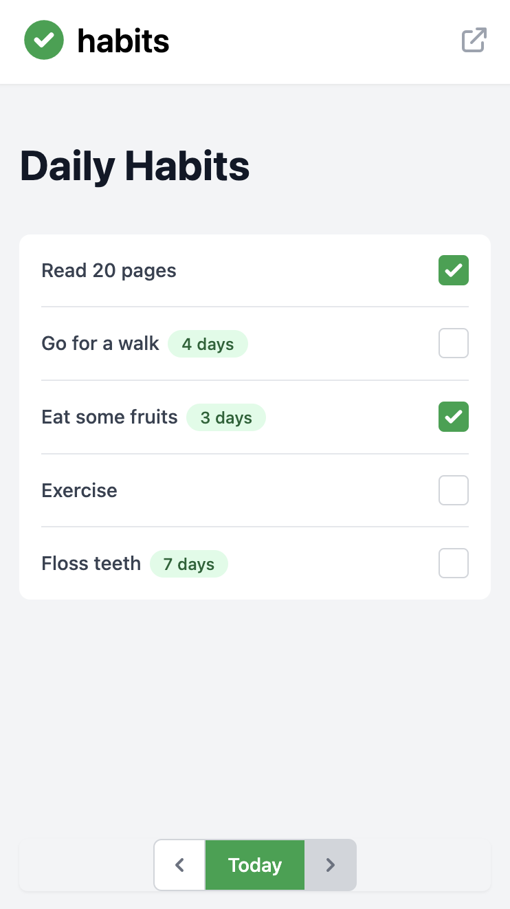

<!-- Based on https://github.com/othneildrew/Best-README-Template -->

<div id="top"></div>

<!-- PROJECT SHIELDS -->

[![Issues][issues-shield]][issues-url]
[![MIT License][license-shield]][license-url]

<!-- PROJECT LOGO -->
<br />
<div align="center">
  <a href="https://github.com/flowirtz/habits">
    
  </a>

<h3 align="center">habits</h3>

  <p align="center">
    A simple habit tracker, built on the Cloudflare stack.
    <br />
    <!-- <a href="https://github.com/flowirtz/habits"><strong>Explore the docs »</strong></a> -->
    <!-- <br /> -->
    <br />
    <a href="https://habits.flowirtz.dev/">View Demo</a>
    ·
    <a href="https://github.com/flowirtz/habits/issues">Report Bug</a>
    ·
    <a href="https://github.com/flowirtz/habits/issues">Request Feature</a>
  </p>
</div>

<br /><br />

<!-- TABLE OF CONTENTS -->
<details>
  <summary>Table of Contents</summary>
  <ol>
    <li>
      <a href="#about-the-project">About The Project</a>
      <ul>
        <li><a href="#built-with">Built With</a></li>
      </ul>
    </li>
    <li>
      <a href="#getting-started">Getting Started</a>
      <ul>
        <li><a href="#prerequisites">Prerequisites</a></li>
        <li><a href="#installation">Installation</a></li>
      </ul>
    </li>
    <li><a href="#roadmap">Roadmap</a></li>
    <li><a href="#contributing">Contributing</a></li>
    <li><a href="#license">License</a></li>
    <li><a href="#contact">Contact</a></li>
    <li><a href="#acknowledgments">Acknowledgments</a></li>
  </ol>
</details>

<!-- ABOUT THE PROJECT -->

## About The Project

 <br /><br />

> "When you learn to transform your habits, you can transform your life."
> <br />
> -James Clear, Author of Atomic Habits

_habits_ is a habit tracker that's built on the Cloudflare stack. It allows you to easily track your habits and build new ones.

This project was built as part of [Cloudflare's Spring Developer Challenge](https://challenge.developers.cloudflare.com/) 2022. It is a fully working app.

<p align="right">(<a href="#top">back to top</a>)</p>

### Built With

- [Cloudflare Pages](https://pages.cloudflare.com/)
- [Cloudflare Workers](https://workers.cloudflare.com/)
- [Cloudflare Workers KV](https://developers.cloudflare.com/workers/learning/how-kv-works/)
- [lukeed/Worktop](https://github.com/lukeed/worktop)
- [Next.js](https://nextjs.org/)

<p align="right">(<a href="#top">back to top</a>)</p>

<!-- GETTING STARTED -->

## Getting Started

To get a local copy up and running follow these simple steps.

### Prerequisites

You will need a Cloudflare account as well as an Auth0 account to run the app. The free versions are sufficient for both of them.

You will also need the Wrangler CLI for the backend and Yarn/Node.js for the frontend.

### Installation

1. Clone the repo
   ```sh
   git clone https://github.com/flowirtz/habits.git
   ```
2. Follow the instructions in `apps/habits-frontend/README.md` to install the frontend.
3. Follow the instructions in `apps/habits-backend/README.md` to install the backend.

<p align="right">(<a href="#top">back to top</a>)</p>

<!-- ROADMAP -->

## Roadmap

- [x] Make the date selector work
- [ ] Restrict CORS
- [ ] Add authentication to the backend
- [ ] Edit habits
- [ ] Delete habits
- [ ] Add a GitHub-like heatmap to explore trends

See the [open issues](https://github.com/flowirtz/habits/issues) for a full list of proposed features (and known issues).

<p align="right">(<a href="#top">back to top</a>)</p>

<!-- CONTRIBUTING -->

## Contributing

Contributions are what make the open source community such an amazing place to learn, inspire, and create. Any contributions you make are **greatly appreciated**.

If you have a suggestion that would make this better, please fork the repo and create a pull request. You can also simply open an issue with the tag "enhancement".
Don't forget to give the project a star! Thanks again!

1. Fork the Project
2. Create your Feature Branch (`git checkout -b feature/AmazingFeature`)
3. Commit your Changes (`git commit -m 'Add some AmazingFeature'`)
4. Push to the Branch (`git push origin feature/AmazingFeature`)
5. Open a Pull Request

<p align="right">(<a href="#top">back to top</a>)</p>

<!-- LICENSE -->

## License

Developed and distributed under the MIT License. See `LICENSE` for more information.

<p align="right">(<a href="#top">back to top</a>)</p>

<!-- CONTACT -->

## Contact

Flo Wirtz - [@flowirtz](https://twitter.com/flowirtz)

Project Link: [https://github.com/flowirtz/habits](https://github.com/flowirtz/habits)

<p align="right">(<a href="#top">back to top</a>)</p>

<!-- ACKNOWLEDGMENTS -->

## Acknowledgments

Thank you to the [Cloudflare Developer Challenge](https://challenge.developers.cloudflare.com/) for giving me the motiviation to finally build this!

<p align="right">(<a href="#top">back to top</a>)</p>

<!-- MARKDOWN LINKS & IMAGES -->
<!-- https://www.markdownguide.org/basic-syntax/#reference-style-links -->

[contributors-shield]: https://img.shields.io/github/contributors/flowirtz/habits.svg?style=for-the-badge
[contributors-url]: https://github.com/flowirtz/habits/graphs/contributors
[forks-shield]: https://img.shields.io/github/forks/flowirtz/habits.svg?style=for-the-badge
[forks-url]: https://github.com/flowirtz/habits/network/members
[stars-shield]: https://img.shields.io/github/stars/flowirtz/habits.svg?style=for-the-badge
[stars-url]: https://github.com/flowirtz/habits/stargazers
[issues-shield]: https://img.shields.io/github/issues/flowirtz/habits.svg?style=for-the-badge
[issues-url]: https://github.com/flowirtz/habits/issues
[license-shield]: https://img.shields.io/github/license/flowirtz/habits.svg?style=for-the-badge
[license-url]: https://github.com/flowirtz/habits/blob/master/LICENSE.txt
[linkedin-shield]: https://img.shields.io/badge/-LinkedIn-black.svg?style=for-the-badge&logo=linkedin&colorB=555
[product-screenshot]: images/screenshot.png
